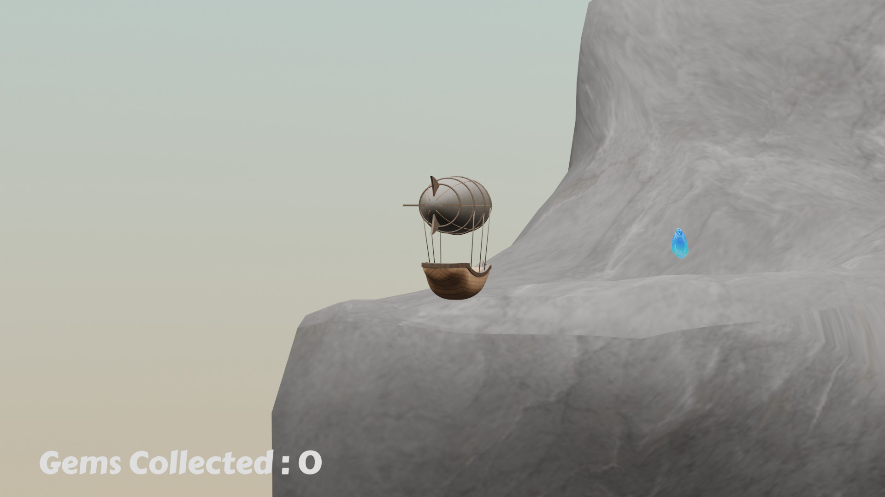

# Contemplative adventure game

> A contemplative game using OpenGL, GLFW, Glew and glm.



## Table of Contents

* [Get started](#get-started)
  * [Development convention](#development-convention)
  * [Repository](#repository)
  * [Linux](#linux)
    * [Requirements](#requirements)
    * [Usage](#usage)
  * [Windows and Mac OSX](#windows-and-mac-osx)
    * [CLion](#clion)
    * [Visual Studio 2019](#visual-studio-2019)
    * [Visual Studio Code](#visual-studio-code)
* [Features](#features)
* [Resources](#resources)

## Get started

### Development convention

As a developer working on this project, you will have to respect some conventions.

In order to begin working on a new feature, you will have to checkout the dev branch. Once you are done, you will create a new branch from the dev branch with the following name convention :

```
$ dev_[feature-name]
```

### Repository

The template uses submodules for its main libraries.

So to clone the repository, use the following command:

```
$ git clone --recursive https://github.com/vscav/contemplative-game.git
```

Alternatively, if you don't used the --recursive option, you can later run:

```
$ git submodule init
$ git submodule update
```

### Linux

You can build the project on linux by using command lines only. In order to do that, you will have to follow some steps.

#### Requirements

First, Update package database:

```
$ sudo apt update
```

And install the updates identified previously:

```
$ sudo apt upgrade
```

Then, install g++ (a C++ compiler):

```
$ sudo apt install g++
```

Finally, install CMake:

```
$ sudo apt install cmake
```

#### Usage

In the apllication directory, create the build folder and move into it:

```
$ mkdir build && cd build
```

Build and compile the template:

```
$ cmake .. && make -j
```

Run the executable by using this pattern:

```
$ ./app
```

The template uses Doxygen as its main documentation generator for its engine. If you have previously installed Doxygen, run the following command:

```
$ make doc
```

The documentation can be found in `build/doc/doc`. It is generated as html and LaTeX files.

### Windows and Mac OSX

#### CLion

The template can be build on Windows and Mac OSX by using CLion, a C/C++ IDE.

Open CLion and go to `File/Open`. Then, in the search window, select the template directory containing the CMake file.

CLion will detect that the opened project is a CMake project and will generate and build the files.

Then, you just need to check that the app executable is selected in the dropdown menu at the top and run it by clicking on the play button.

To generate the documentation, select the docs executable in the dropdown list and as well run it by clicking on the play button.

#### Visual Studio 2019

Coming soon.

#### Visual Studio Code

Coming soon.

## Features

Coming soon.

## Resources

- [OpenGL](https://www.khronos.org/registry/OpenGL-Refpages/gl4/) - OpenGL documentation
- [GLFW](https://www.glfw.org/documentation.html) - GLFW documentation
- [Doxygen](https://www.doxygen.nl/manual/index.html) - Doxygen documentation
- [CMake](https://cmake.org/cmake/help/v3.19/) - CMake documentation
- [CLion](https://www.jetbrains.com/fr-fr/clion/) - Download CLion IDE
- [Visual Studio 2019](https://visualstudio.microsoft.com/fr/vs/) - Download Visual Studio 2019 IDE
- [Visual Studio Code](https://code.visualstudio.com/) - Download Visual Studio Code
